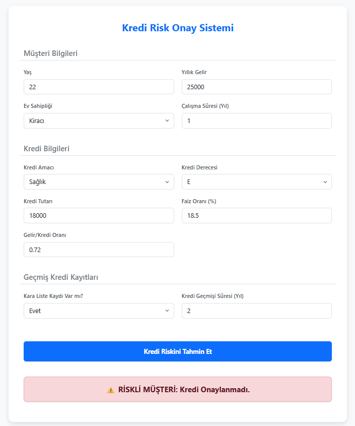

# 🚀 End-to-End Credit Risk Prediction with XGBoost & FastAPI

Bu proje, bankacılık ve finans sektöründeki kredi başvuru süreçlerini otomatize etmek amacıyla geliştirilmiş uçtan uca bir makine öğrenmesi ve web API entegrasyonu (MLOps) çalışmasıdır. Müşterilerin demografik bilgileri, finansal geçmişleri ve kredi talepleri analiz edilerek kredinin geri ödenmeme riski (temerrüt) tahmin edilmektedir. 

Modelin eğitimi aşamasında sızıntısız (data leakage-free) bir makine öğrenmesi boru hattı (Pipeline) kurgulanmış, kategorik veriler için One-Hot ve Ordinal Encoder, sayısal veriler için StandardScaler kullanılmıştır. Hiperparametre optimizasyonu RandomizedSearchCV ile tamamlanan XGBoost algoritması, FastAPI kullanılarak modern bir web arayüzü ile canlıya alınmıştır.

## 🛠️ Kullanılan Teknolojiler
* **Makine Öğrenmesi & Veri Bilimi:** Python, Pandas, NumPy, Scikit-Learn, XGBoost
* **Arka Plan (Backend) & API:** FastAPI, Uvicorn, Pydantic
* **Ön Yüz (Frontend):** HTML5, Bootstrap 5, JavaScript (Fetch API), Jinja2Templates
* **Model Kayıt (Serialization):** Pickle

## 🧠 Makine Öğrenmesi Boru Hattı (Pipeline) Mimarisi
Eğitim aşamasında veri ön işleme (preprocessing) ve modelleme adımları tek bir `Pipeline` nesnesi içinde birleştirilmiştir. Bu mimari sayesinde dışarıdan gelen yepyeni bir müşteri verisi, canlı ortamda manuel dönüşümlere ihtiyaç duymadan doğrudan sisteme beslenebilmektedir. Kategorik sütunlar (Ev sahipliği, Kredi amacı) dönüştürülmüş, aykırı değerler analiz edilmiş ve XGBoost modelinin hiperparametreleri (max_depth, learning_rate, subsample vb.) optimize edilerek ezberlemenin (overfitting) önüne geçilmiştir.

## 💻 Canlıya Alma (Deployment) ve Kullanım
Proje, bir REST API olarak hizmet vermektedir ve kullanıcı dostu bir web arayüzüne sahiptir. Gelen JSON formatındaki HTTP POST istekleri FastAPI arka planında işlenir, eğitilmiş Pickle modeli üzerinden geçirilir ve anında risk raporu (Onay/Ret) olarak geri döndürülür.


### Kurulum Adımları
Projeyi kendi bilgisayarınızda çalıştırmak için aşağıdaki adımları izleyebilirsiniz:

1. Repoyu bilgisayarınıza indirin:
```bash
git clone [https://github.com/KULLANICI_ADIN/REPO_ADIN.git](https://github.com/KULLANICI_ADIN/REPO_ADIN.git)
cd REPO_ADIN
